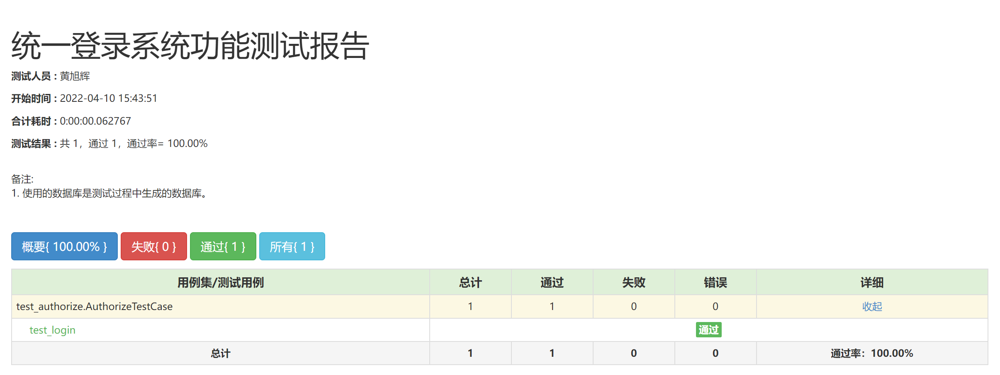
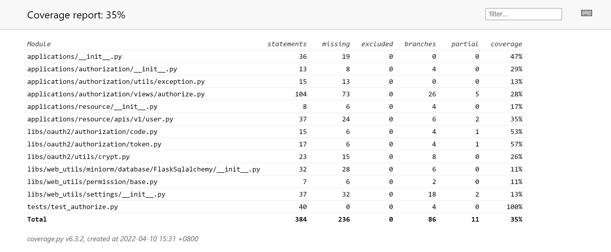
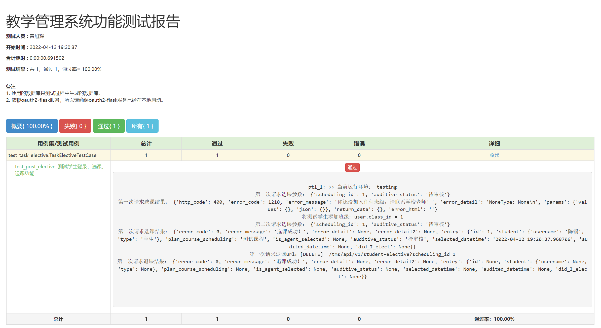
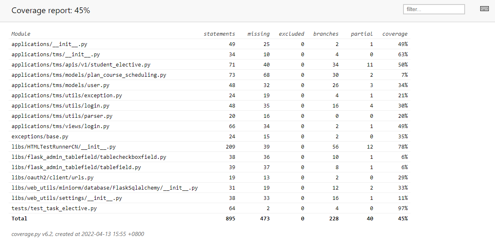
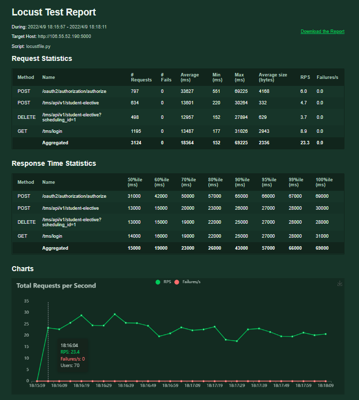
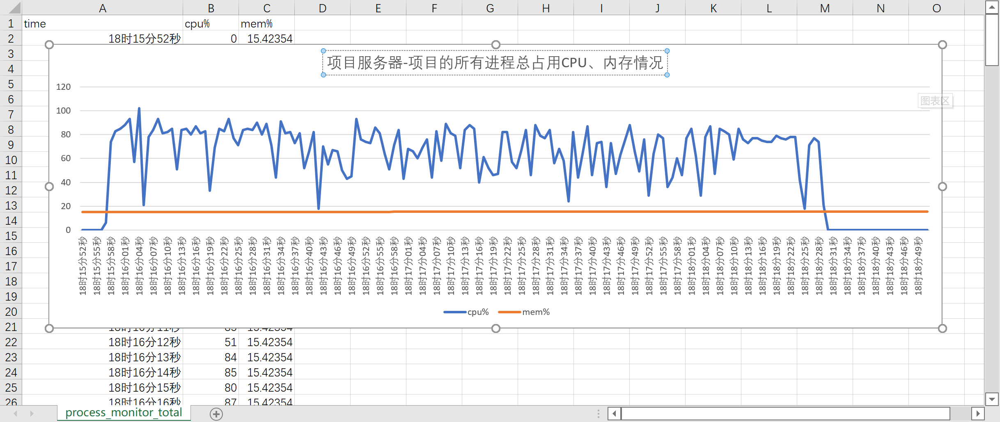
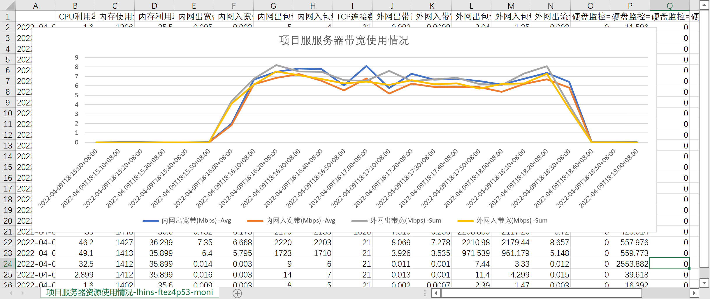
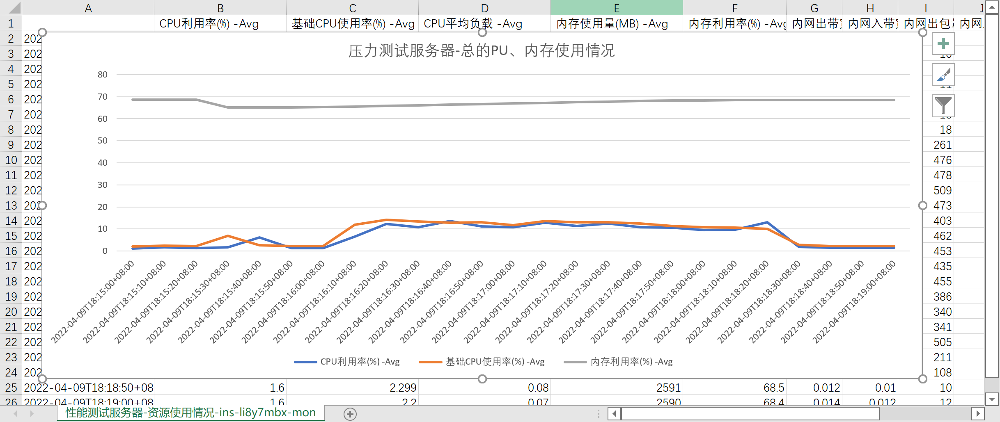
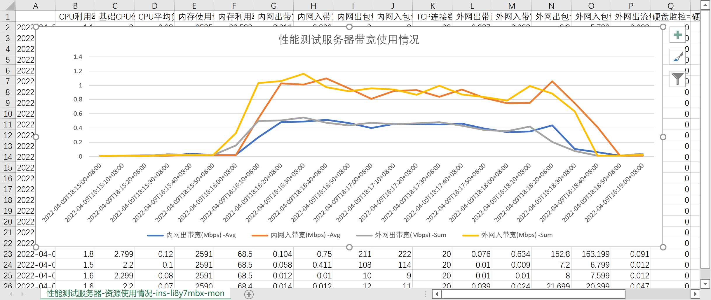

# 目录

[TOC]

# 1. 简介

这是一份面向运维人员的文档。

# 2. 约定

1. 由于需要安装依赖，所以需要联网安装。

# 3. 安装

安装支持`production(生产环境)`、`development(开发环境)`两种，可以通过修改配置文件的`config_name`这一项，决定运行环境。

1. `1code/`文件夹是这个项目的所有代码，需要将这个文件夹放到服务器的`ubuntu/projects/graduration-design/`路径下，如果没有该路径，请自己创建，最终这个代码文件夹的路径效果如下：`ubuntu/projects/graduration-design/1code/`。

2. 命令行进入文件夹、备份、并修改配置文件：

```shell
# 进入文件夹
cd /home/ubuntu/projects/graduration-design/1code

# 备份配置文件
cp config.conf.example config.conf

# 修改配置文件，建议只修改：oauth2_domain、tms_domain这两项的ip地址。
vim config.conf
```

2. 安装：

```shell
bash install.sh
```

4. 这时候已经安装完成，打开：`http://your-server-ip:5000/tms`就可以看到结果，如果安装到服务器，请将ip和port按实际填写。具体业务使用，请看[3.用户文档（业务使用教程）](./3.用户文档（业务使用教程）.md)

# 4. 卸载

1. 命令行进行卸载：

```shell
# 进入文件夹
cd /home/ubuntu/projects/graduration-design/1code

# 运行卸载脚本
bash uninstall.sh
```

# 5. 测试

测试分为功能测试、性能测试。

**注意：测试前，请确保已经完成上面的[安装](#安装)。**

## 5.1. 功能测试

1. 执行测试命令

```shell
# 进入文件夹
cd /home/ubuntu/projects/graduation-design/1code
# 执行测试脚本
bash test.sh
```

2. 生成下面的功能测试报告：
	1. 统一登录系统
		1. 功能测试报告：1code/oauth2-flask/server/tmp/统一登录系统功能测试报告.html
		2. 代码覆盖率报告：1code/oauth2-flask/server/tmp/coverage/index.html
	2. 教学管理系统
		1. 功能测试报告：1code/oauth2-flask/server/tmp/统一登录系统功能测试报告.html
		2. 代码覆盖率报告：1code/oauth2-flask/server/tmp/coverage/index.html

3. 在windows打开终端，将整个tmp文件复制到windows本地，然后拖动上述文件到浏览器查看测试报告：

```shell
scp ubuntu@106.55.52.190:/home/ubuntu/projects/graduration-design/1code/oauth2-flask/server/tmp/ ./oauth2-tmp
scp ubuntu@106.55.52.190:/home/ubuntu/projects/graduration-design/1code/tms-flask/server/tmp/ ./tms-tmp
```

## 5.2. 性能测试

性能测试建议在另外一台主机下使用locust对服务器主机进行测试，避免占用服务器资源，从而影响测试结果。

性能测试脚本已经被包含在项目里，只需要安装测试框架就能使用。这个测试脚本是对整个项目进行测试的，没有单独对某个单元做单独的性能测试。

1. 在项目服务器执行性能监控脚本：

```shell
# 进入文件夹
cd /home/ubuntu/projects/graduation-design/1code/monitor
# 执行性能监控脚本
bash monitor.sh
```

2. 然后在性能测试服务器启动性能测试框架locust：
```shell
1.	# 下载locust
2.	pip3 install locust
3.	# 进入文件夹
4.	cd /home/ubuntu/projects/graduation-design/1code/monitor
5.	# 执行性能监控脚本
6.	locust
```

3. 生成下面的压力测试报告：
	1. 项目服务器
		1. 性能记录文件:`1code/monitor/process_monitor_total.csv`
	2. 压力测试服务器网页
		1. 压力测试报告

4. 将性能记录`1code/monitor/process_monitor_total.csv`文件拉取到windows。

```shell
scp ubuntu@106.55.52.190:/home/ubuntu/projects/graduration-design/1code/monitor/process_monitor_total.csv ./process_monitor_total.csv
```

5. 用excel打开`process_monitor_total.csv`性能记录文件、修改时间格式、插入图表，使数据可视化。

6. 同理，在项目服务器、压力测试服务器的运营商（如腾讯云阿里云）上下载服务器的性能监控，其中包含CPU、内存、带宽等数据，保存为CSV格式，然后用excel打开，插入图表可视化。

## 5.3. 功能测试示例

1. 统一登录系统功能测试报告：



2. 统一登录系统功能测试代码覆盖率报告：



3. 教学管理系统功能测试报告：



4. 教学管理系统功能测试代码覆盖率报告：




## 5.4. 性能测试示例

这是本次性能测试相关数据。

完成日期时间：2022年4月9日 20点01分。

### 5.4.1. 所测试的服务器配置

1. 运行项目的服务器

| 项 | 配置 |
| ---- | ---- |
| CPU | 2核，Intel(R) Xeon(R) Platinum 8255C CPU @ 2.50GHz |
| 内存 | 4G，型号未知 |
| 公网带宽 | 8Mbps |
| 操作系统 | Ubuntu Server 20.04 LTS 64位 |
| Python版本 | Python3.8 |
| supervisor版本 | 4.1.0 |
| gunicorn版本 | 20.0.4 |
| Mysql版本 | 8.0.28 |
| docker版本（运行了mysql） | 20.10.7 |


2. 运行性能测试的服务器

| 项 | 配置 |
| ---- | ---- |
| CPU | 2核，Intel(R) Xeon(R) CPU E5-26xx v4 |
| 内存 | 4G，型号未知 |
| 公网带宽 | 3Mbps |
| 操作系统 | Ubuntu Server 18.04.1 LTS 64位 |
| locust版本 | 2.8.5 |
| Python版本 | Python3.6 |

### 5.4.2. 所测试的代码版本

1. commit id: adbf0d0b057f41c909737d99c66f0cd9a8a15cb4
2. tag: v2.0
3. 链接：http://106.53.148.248:1263/cllen/graduation-design/-/tree/master


### 5.4.3. 重要报告

1. 性能测试服务器-服务处理请求情况：



2. 项目服务器-项目所有进程总占用CPU、内存情况：



3. 项目服务器-带宽使用情况：



4. 性能测试服务器-总CPU、内存使用情况：



5. 性能测试服务器-带宽使用情况：




### 5.4.4. 性能测试总结（对上述各种文件的总结）

通过各种测试报告，总结如下：

1. 运行项目服务器的资源使用情况

| 项 | 值 |
| ---- | ---- |
| 所测试的接口 | 4个，分别是get登录，post登录，post选课，delete选课 |
| 每秒处理请求数 | 20-30个 |
| 项目占用CPU | 约100%（2核共200%，所以占用每核各约50%） |
| 项目占用内存 | 约20% |
| 项目占用带宽情况 | 出入带宽各约6-8Mbps |

2. 运行性能测试服务器的资源使用情况

| 项 | 值 |
| ---- | ---- |
| 性能测试占用CPU | 10%-20%（总100%） |
| 性能测试占用内存 | 约70% |
| 性能测试占用带宽情况 | 出带宽约0.4Mbps，入带宽约0.8-1.2Mbps |

3. 即：
	1. 对于4个重点接口，该项目在既定配置下，处理能力为每秒处理20-30各接口。
	1. 项目服务器的带宽达到瓶颈。
	2. 性能测试脚本服务器各项未达到瓶颈。

### 5.4.5. 文件说明

1. `process_monitor_total.csv`是所有`process_monitor_*`的总和，而后者是每个gunicorn进程占用的CPU、内存情况。
2. `locust_report.pdf`和`report_1649499562.2262082.html`都是性能测试报告，只是格式不同。
3. `项目服务器-资源使用情况-lhins-ftez4p53-monitor-data.csv`是项目服务器运行项目时的资源占用情况。
4. `性能测试服务器-资源使用情况-ins-li8y7mbx-monitor-data.csv`是性能测试服务器运行性能测试脚本时的资源占用情况。
5. 各种`*.png`截图是从上面4分报告中使用excel制作表格所截图出来的数据。
6. `locustfile.py`为性能测试脚本，需要locust运行。
7. `monitor.py`为项目服务器资源监控脚本，不能直接运行。
8. `monitor.sh`为对5000、5001端口占用的所有进程的性能监控脚本，可以直接运行，命令为`bash monitor.sh 180`，后面是秒数。


### 5.4.6. 截图来源的文件

1. 性能测试报告：性能测试服务器-服务处理请求情况.png / locust_report.pdf / report_1649499562.2262082.html
2. 项目服务器CPU、内存使用报告：项目服务器-项目所有进程总占用CPU、内存情况.png / process_monitor_total.csv
3. 项目服务器带宽使用报告：项目服务器-带宽使用情况.png / 项目服务器-资源使用情况-lhins-ftez4p53-monitor-data.csv
4. 性能测试服务器总CPU、内存使用报告：性能测试服务器-总CPU、内存使用情况.png
5. 性能测试服务器带宽使用报告：性能测试服务器-带宽使用情况.png

有空再写。

# 6. 对于运维人员的重要文件

1. 配置文件:`1code/config.conf.example`（注意，请复制到`1code/config.conf`并使用该文件，不要使用`example`结尾文件）。
2. 安装脚本:`1code/install.sh`。
3. 卸载脚本:`1code/uninstall.sh`。
4. tms服务启动脚本:`1code/tms-flask/boot.sh`。
5. oauth2服务启动脚本:`1code/oauth2-flask/boot.sh`。
6. tms的supervisor配置文件:`1code/tms-flask/supervisor.conf`。
7. oauth2的supervisor配置文件:`1code/oauth2-flask/supervisor.conf`。
