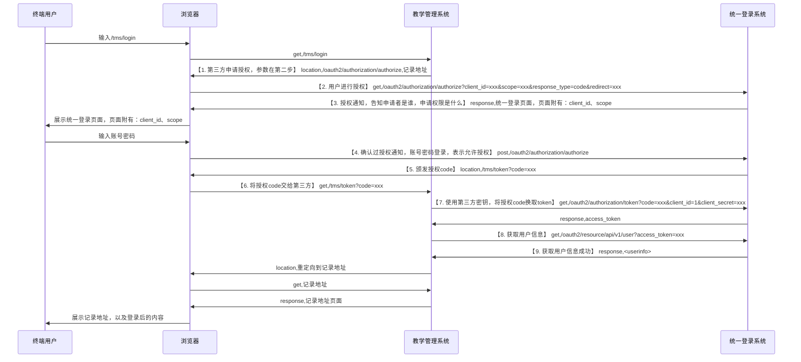

# 简介

这是架构文档。

# 架构

```mermaid
sequenceDiagram
participant 终端用户
participant 浏览器
participant 教学管理系统
participant 统一登录系统

终端用户 ->> 浏览器 : 输入/tms/login
浏览器 ->> 教学管理系统 : get,/tms/login
教学管理系统 ->> 浏览器 : 【1. 第三方申请授权，参数在第二步】 location,/oauth2/authorization/authorize,记录地址

浏览器 ->> 统一登录系统 : 【2. 用户进行授权】 get,/oauth2/authorization/authorize?client_id=xxx&scope=xxx&response_type=code&redirect=xxx
统一登录系统 ->> 浏览器 : 【3. 授权通知，告知申请者是谁，申请权限是什么】 response,统一登录页面，页面附有：client_id、scope
浏览器 ->> 终端用户 : 展示统一登录页面，页面附有：client_id、scope
终端用户 ->> 浏览器 : 输入账号密码
浏览器 ->> 统一登录系统 : 【4. 确认过授权通知，账号密码登录，表示允许授权】 post,/oauth2/authorization/authorize
统一登录系统 ->> 浏览器 : 【5. 颁发授权code】 location,/tms/token?code=xxx
浏览器 ->> 教学管理系统 : 【6. 将授权code交给第三方】 get,/tms/token?code=xxx
教学管理系统 ->> 统一登录系统 : 【7. 使用第三方密钥，将授权code换取token】 get,/oauth2/authorization/token?code=xxx&client_id=1&client_secret=xxx
统一登录系统 ->> 教学管理系统 : response,access_token
教学管理系统 ->> 统一登录系统 : 【8. 获取用户信息】 get,/oauth2/resource/api/v1/user?access_token=xxx
统一登录系统 ->> 教学管理系统 : 【9. 获取用户信息成功】 response,<userinfo>
教学管理系统 ->> 浏览器 : location,重定向到记录地址
浏览器 ->> 教学管理系统 : get,记录地址
教学管理系统 ->> 浏览器 : response,记录地址页面
浏览器 ->> 终端用户 : 展示记录地址，以及登录后的内容
```

# 使用

具体看运维文档： [2.运维文档（安装、测试）](./2.运维文档（安装、测试）.md)
